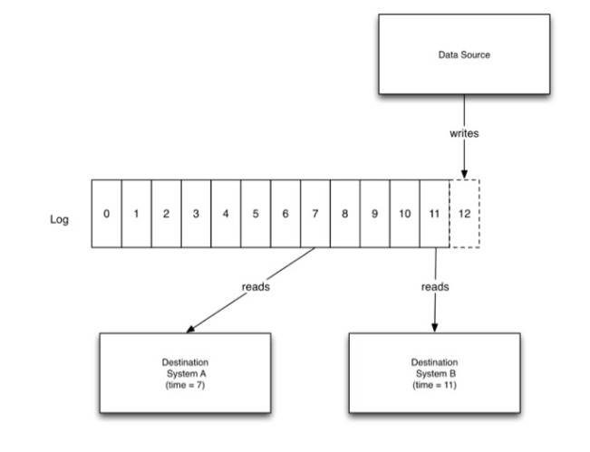
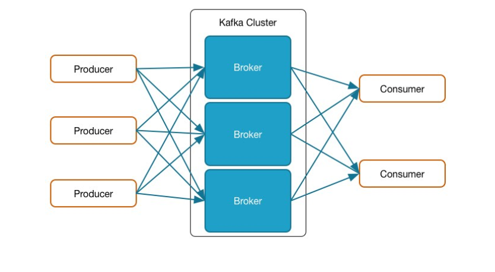
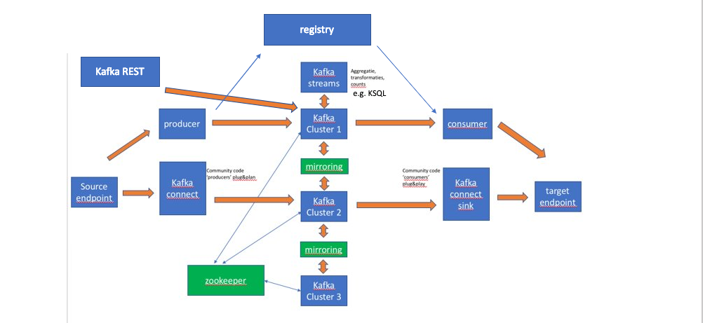

[Next Lab](https://github.com/axonxai/kafka101_workshop/blob/master/lab_01/readme.md)

# LAB-00 Welkom 

**Doel:** Algemeen overzicht van Kafka en bijbehorende terminologie

## Wat is Kafka? 
Een Messaging broker? ESB ?

Kafka is een distributed commit log, vergelijkbaar met GIT, alleen dan geoptimaliseerd voor snelheid. In git commit je ook nieuwe versies van de code, dit is analoog aan Kafka, waar je messages op een log commit. 

In Kafka hebben we het over Producers en Consumers, Producer zetten berichten op de log, Consumers kunnen deze lezen. Het verschil met Messaging is dat de messages op de log blijven staan (persistent) voor een bepaalde retentie tijd, default 7dagen.

In figuur onder, zie je een Data Source als producer, en meerdere consumers. Kafka houd per consumer bij waar je op de log bevindt, de offset. Dus mocht de Consumer crashen, dan bij herstel gaat de Consumer weer verder waar hij gebelven was! 

Een Kafka opzet, Kafka Cluster bestaat uit diverse onderdelen, hoofdzakelijk bestaat een cluster uit diverse brokers, waar meerdere Producers en Consumers naar connecten. Zie figuur

Maar er zijn meer componenten: brokers, zookeeper, Kafka connect, registry, Kafka REST, Kafka Stream / KSQL:

Zookeeper management de brokers. Brokers vormen zelf een fault-tolerant cluster. Producer, consumers hebben we high level besproken en komen vele malen terug in de workshop. Kafka Connect is een speciale producer die je alleen hoeft te configureren, bv. je hebt voor de meeste databases Kafka connectors die data uit de database op topics kunnen zetten, Kafka Sinks doen het omgekeerde. 

Voor de berichten validaties is een registry component, waar schema's staan. Kafka Stream zijn specieke streaming API om directer met Streaming data aan de slag te gaan. KSQL (Kafka SQL) maakt gebruikt van Kafka Streams. Er bestaat ook nog een Kafka REST component, deze was ooit bedoelt voor niet JVM talen met support van schema's.

## Topic & Partitions
Je schrijft messages naar een topic. Een topic zelf is meer een logische naam, die bestaat uit partitions. De partitions zijn de log file die je kunt vinden op de brokers. 

Meer info over partitie opslag op een broker: https://thehoard.blog/how-kafkas-storage-internals-work-3a29b02e026 

De partition geven de versnelling aan het streamen van data. Iedere partitie wordt gerepliceerd over de broker, dit zijn de replica partition slim verdeeld over het aantal brokers. Mocht er een broker onderuit gaan dan zal alles door blijven werken.

Nu we de kreten op een rij hebben kunnen we aan de slag :)

 [Next Lab](https://github.com/axonxai/kafka101_workshop/blob/master/lab_01/readme.md)

