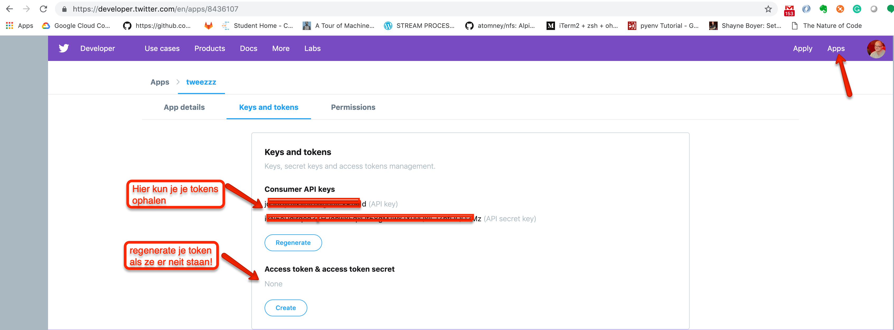
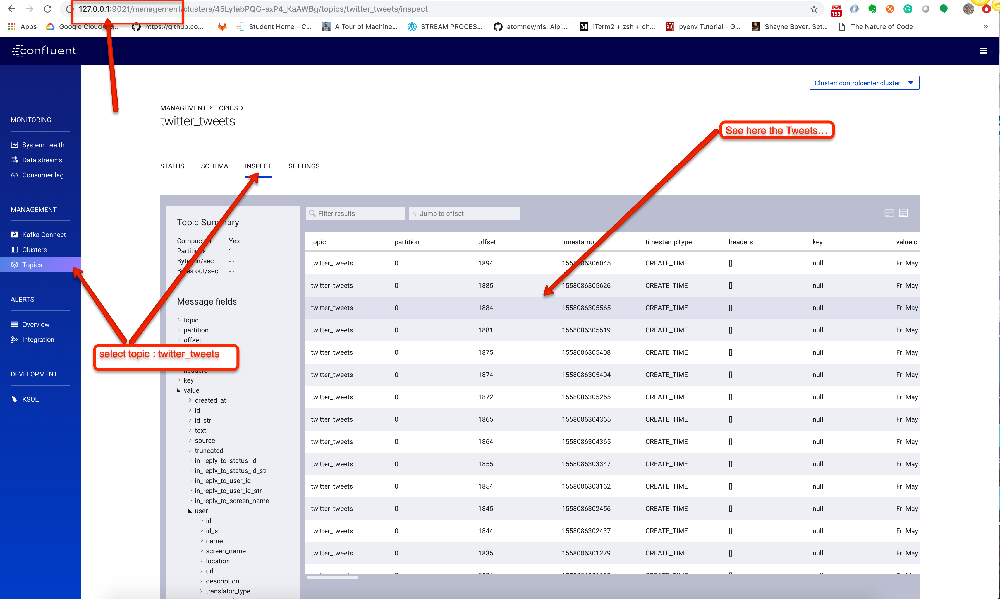

[Previous Lab](https://github.com/axonxai/kafka101_workshop/tree/iteratie_01/lab_01) | [Next Lab](https://github.com/axonxai/kafka101_workshop/tree/iteratie_01/lab_03)

# Lab-02 Data for real, Confluent Console 

Doel: Data ingestion van 'echte' bronnen (sources)

Het wordt tijd voor koppelen met 'echte data bronnen', we gaan aan de slag om van twitter tweets naar Kafka te sturen (topic twitter_tweets)

In de voorbereidingen heb je als het goed is een account op twitter gemaakt, en ook een developer account aaangevraagd bij twitter, via de volgende URL: https://developer.twitter.com/content/developer-twitter/en.html

Log in op de Dev link en maak een App aan, dit wordt ons java programma wat tweets via de API gaat uitlezen. Navigeer naar Credentials tab, zie screendump 

Open je editor en voeg je credentials toe in de java code,

Daarna kun je alles compileren met:

    $ mvn clean install

Nu starten we het java programma, Run het via je IDE of ga hiervoor op de cmdline naar targets en run de 'fat' jar met:

    $ java -jar kafka-producer-twitter-1-jar-with-dependencies.jar

In onze kafka setup zit ook de Confluent Management Console, check via de browser of je de Tweets ziet binnen komen: http://127.0.0.1:9021

In screendump zie je hoe je bij Topics de data stream kunt monitoren:

Okay, we hebben nu genoeg data, stop het Java programa en ga door naar het volgende lab...

[Previous Lab](https://github.com/axonxai/kafka101_workshop/tree/iteratie_01/lab_01) | [Next Lab](https://github.com/axonxai/kafka101_workshop/tree/iteratie_01/lab_03)

 
